# Neural-Net – Multi-Agent Content Creation & Automation

Built for Neural Net

It is a full-stack automation environment for research, writing, design, and publishing. A Next.js 16 dashboard fronts a FastAPI service that hosts LangGraph-driven agents, Groq models, Tavily research tools, and self-hosted Modal workers. Every workflow except the final "publish to X" call is executed inside this stack.

Refer to the imagemodel branch for the self hosted models.

## Screenshots

Our landing page

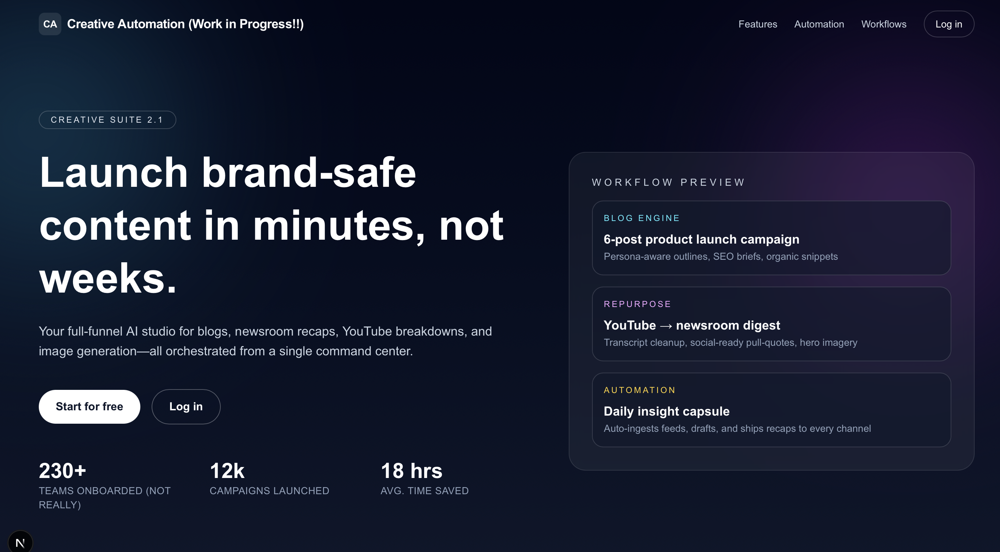

Then login/signup

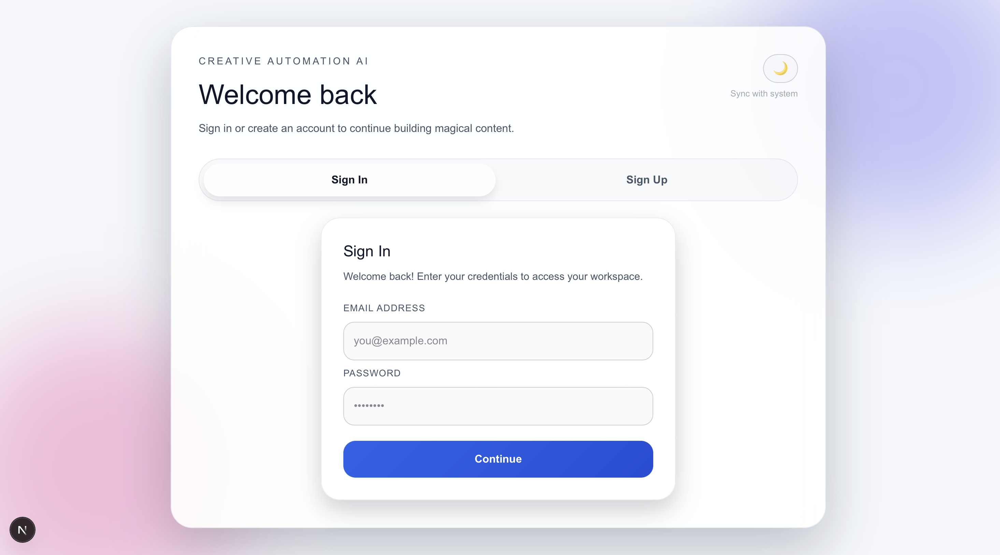

Dashboard home

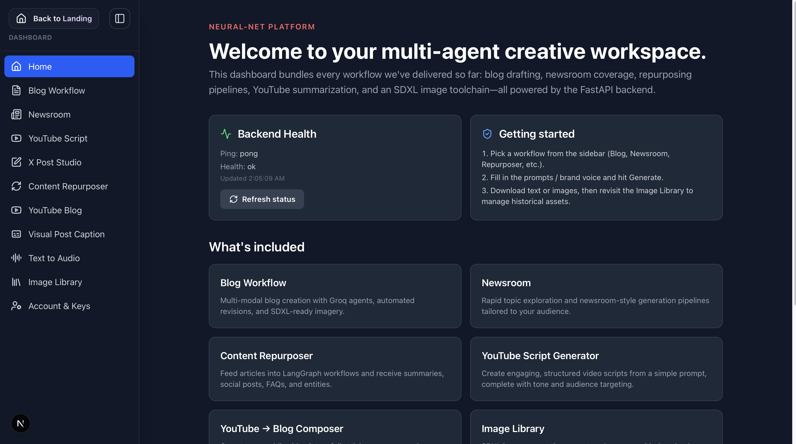

Blog workflow page, describe brand voice and prompt, existing draft, audience etc.

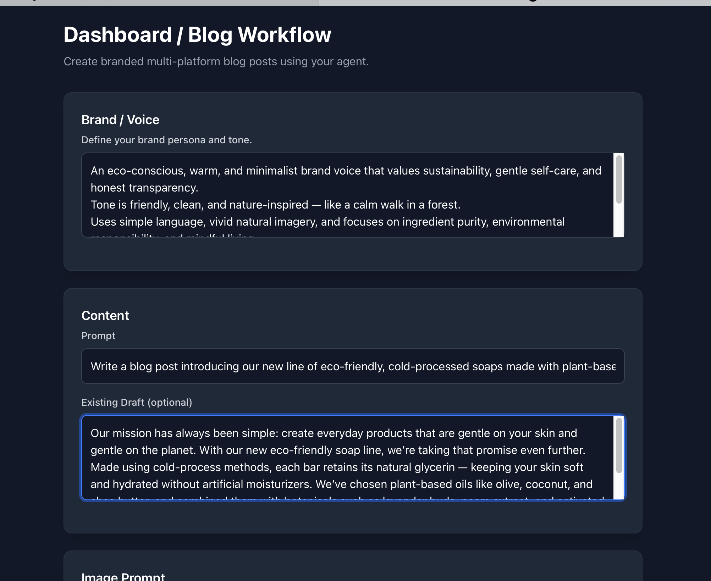

This info generates a prompt for the sdxl turbo model to generate image for the blog
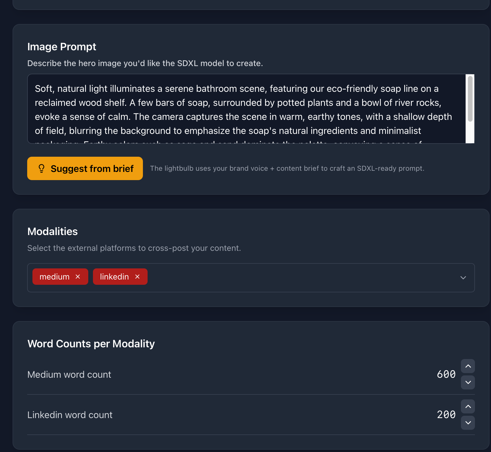

Output is the blog text of all modalities and the image.


Newsroom is similar, equipped with tavily search for the web access layer to generate current events articles.

Similar with youtube script with thumbnail generation. They all differ in the system prompots and the langgraph structure.

X post studio, uses Google Trends to generate ideas based on recent trends. It finds the keywords, and ideas are generated. Then the actual X post maker, you can enter your own post info or directly use the keywords from google trends idea generator.

It is equipped with iterations of generator, evaluator and optimizer to refine the post until it reaches the desired score. Human feedback can also be injected to guide the optimization, but has to be upfront.

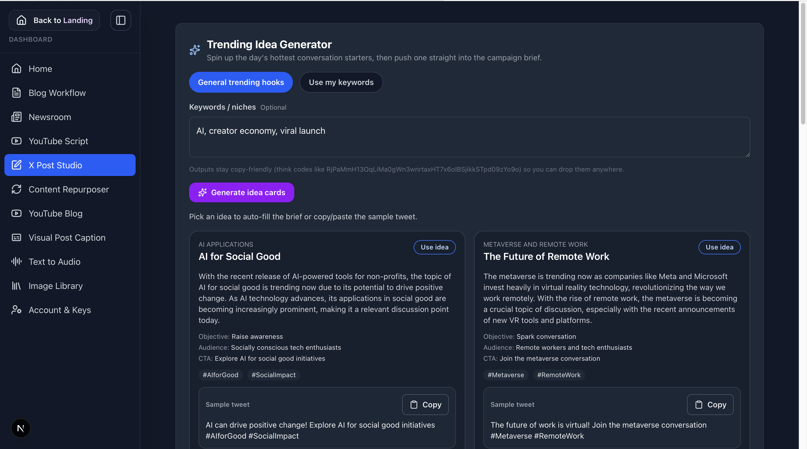

Let's use the remote work post.

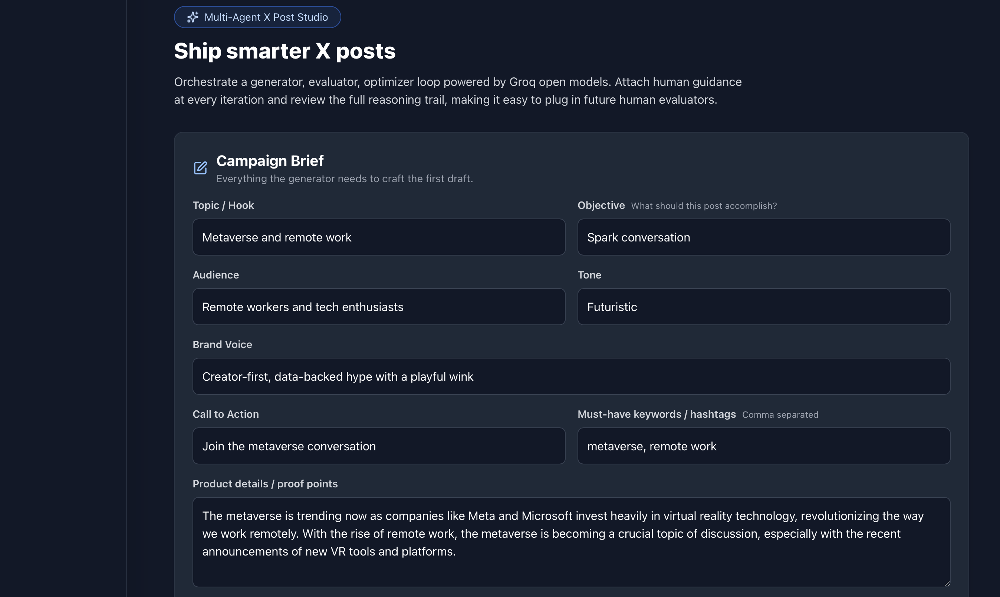

Loop control and human feedback injection.
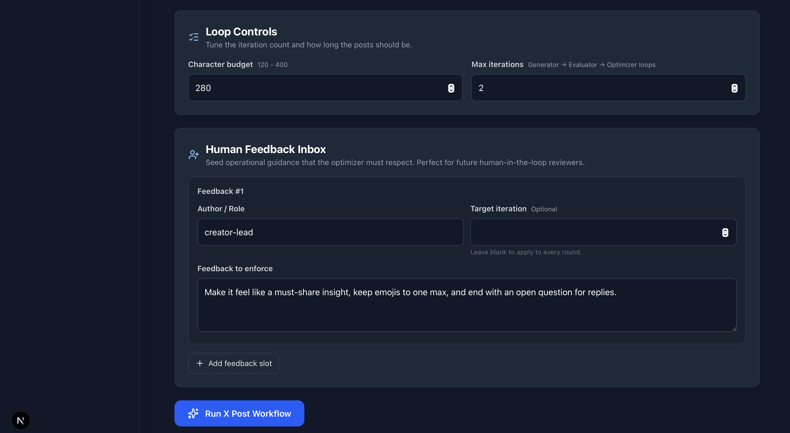

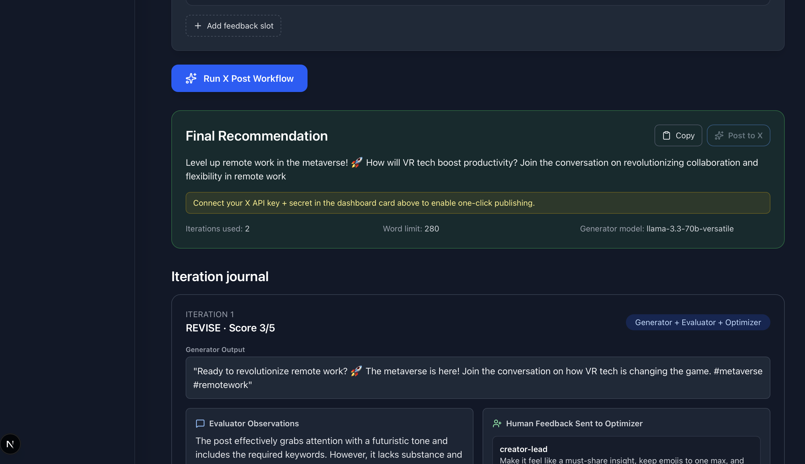
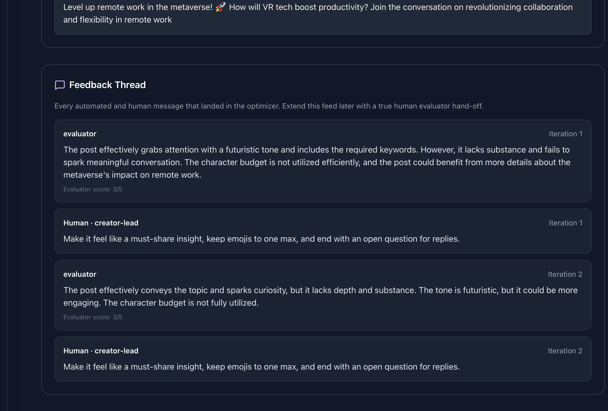

Youtube article generator, can be used by news channels to convert their videos into news articles or by youtubers to generate linkedin posts, blogs(say technical writing blogs from coding videos), instagram posts etc.

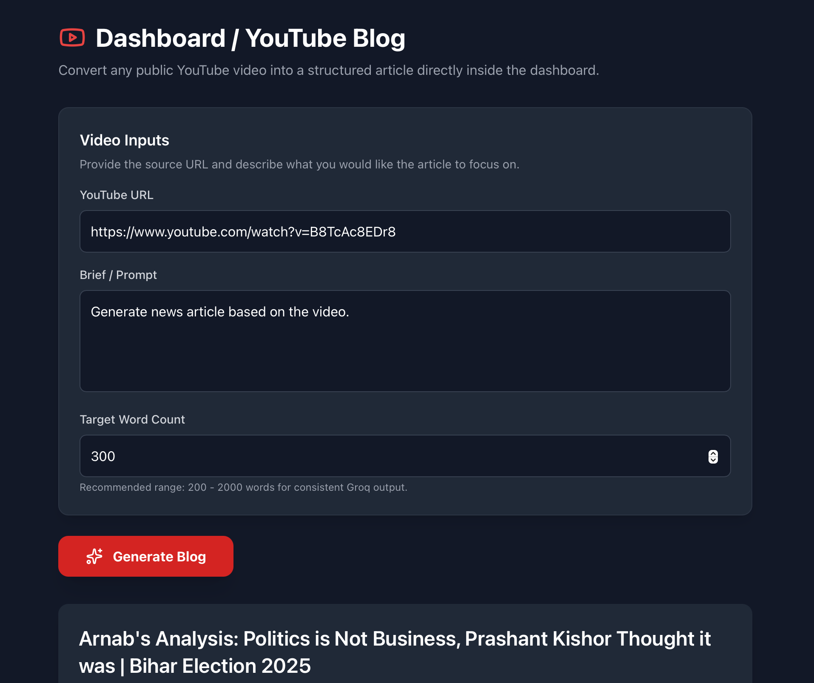
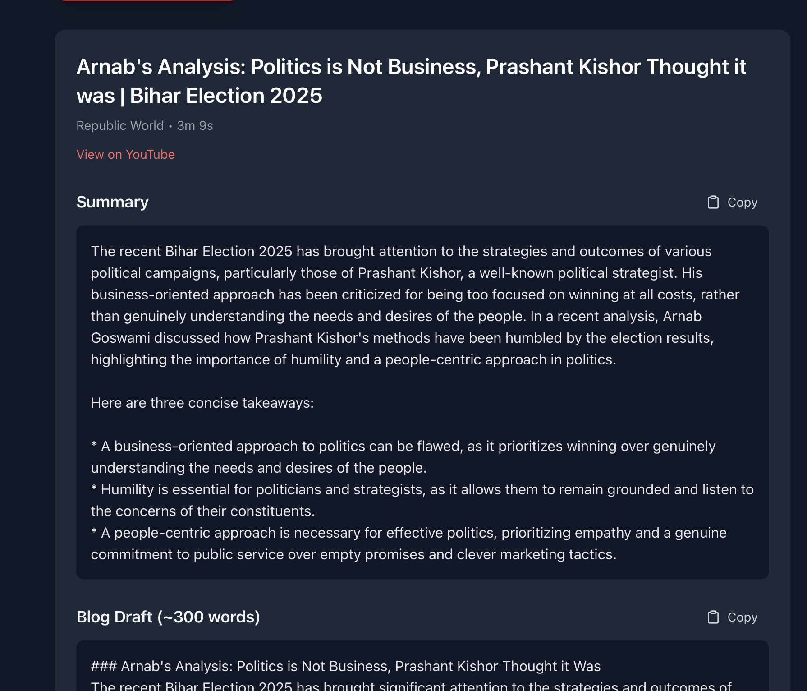

Turn any of the content generated till now or any other content into voiceovers! Self hosteing parler TTS model.
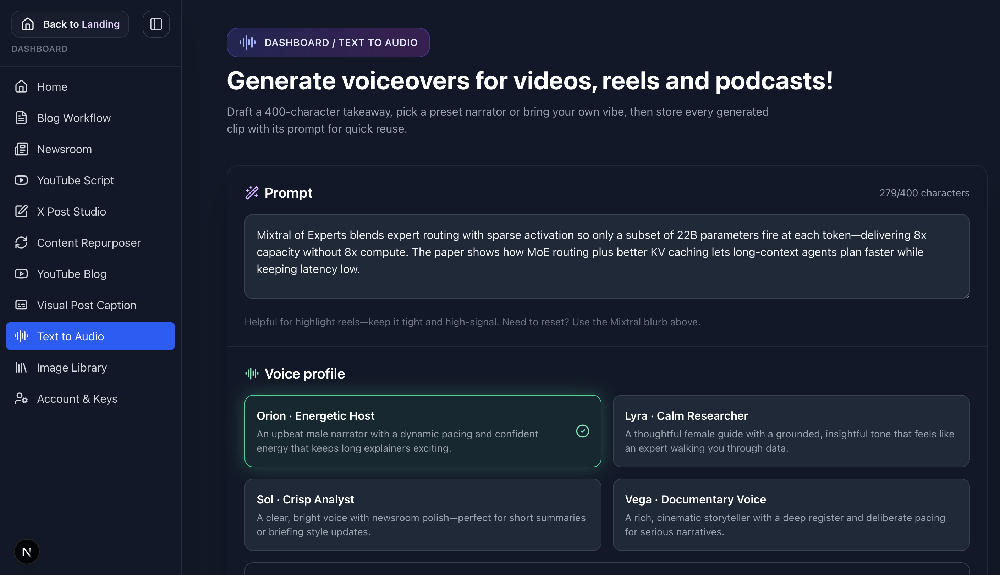

You can access all your previous generated voiceovers here. Retrived from object storage.

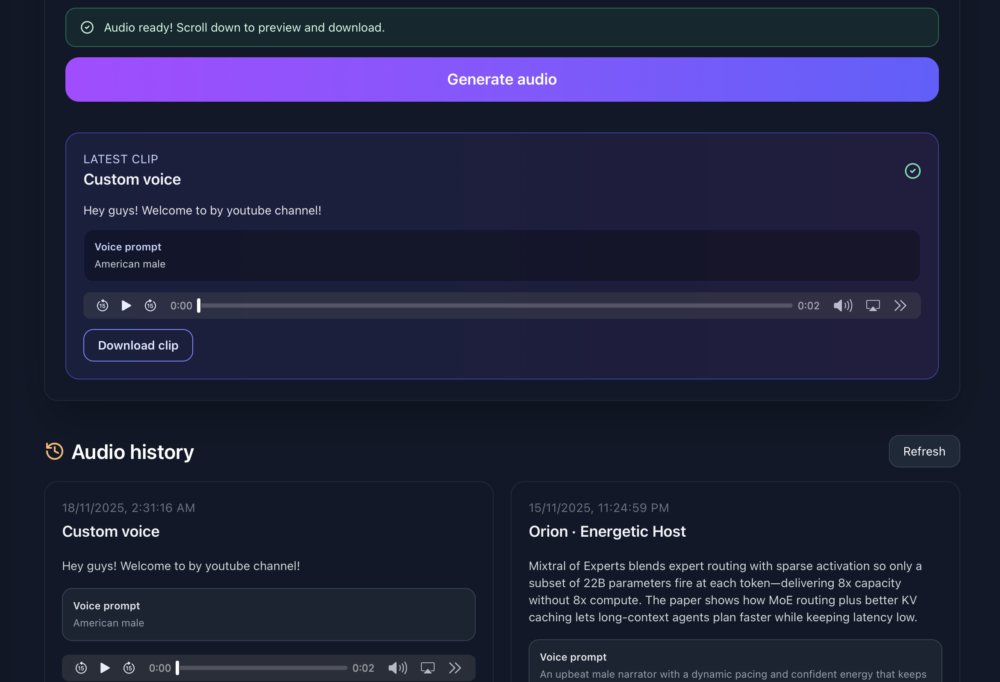

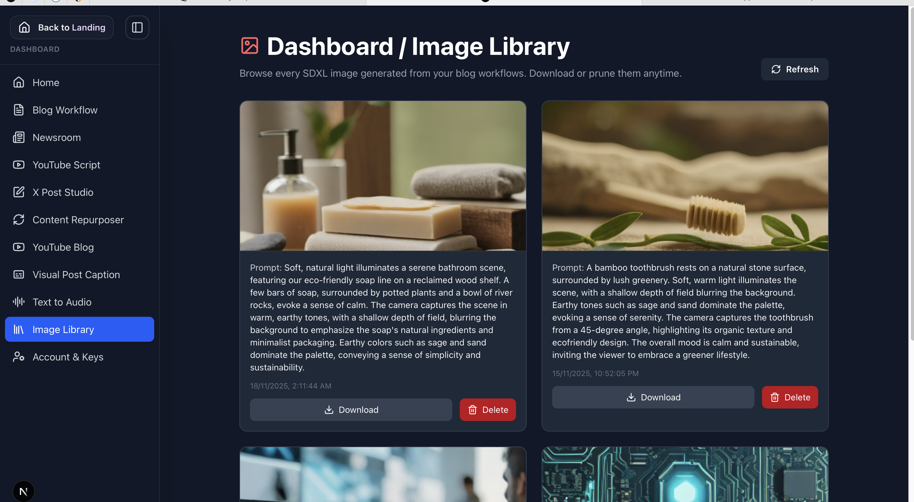

Apart from these, we have a page, that can accept content, like text files, and repurpose it. There is also image captioning, where you can drag and drop images, give a prompt and get a caption back. This is done through self hosted nlpconnects vit+gpt2 model.

## System Highlights

- LangGraph-powered agents for blog creation, newsroom copy, YouTube scripts, multimodal social posts, and content repurposing.
- Groq's `llama-3.3-70b-versatile` and `llama-3.1-8b-instant` models are tuned per node for headline quality, speed, and price.
- Three Modal-hosted microservices (vision captioning, SDXL image generation, Parler TTS) back the creative experiences—without exposing their raw URLs.
- Neon PostgreSQL + Prisma tracks users, generated assets, and encrypted X credentials; Supabase object storage holds the binary media returned by Modal.
- Twitter/X is the only external publishing surface—handled via the official API and encrypted per-user credentials.

## Architecture

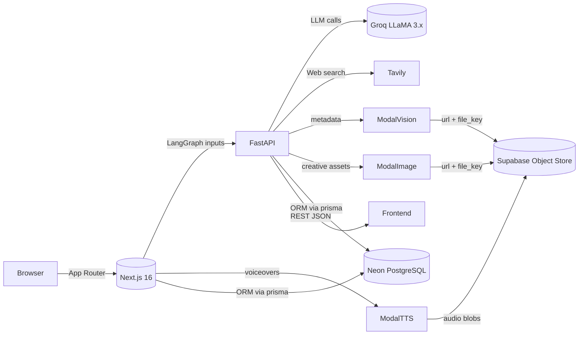
```mermaid
flowchart LR
    Browser -->|App Router| NextJS[(Next.js 16)]
    NextJS -->|LangGraph inputs| FastAPI
    FastAPI -->|LLM calls| GroqLLMs[(Groq LLaMA 3.x)]
    FastAPI -->|Web search| Tavily
    FastAPI -->|metadata| ModalVision
    FastAPI -->|creative assets| ModalImage
    NextJS -->|voiceovers| ModalTTS
    FastAPI -->|ORM via prisma| Neon[(Neon PostgreSQL)]
    NextJS -->|ORM via prisma| Neon
    ModalVision -->|url + file_key| Supabase[(Supabase Object Store)]
    ModalImage -->|url + file_key| Supabase
    ModalTTS -->|audio blobs| Supabase
    FastAPI -->|REST JSON| Frontend
```

## Models & External Services

| Capability            | Primary Model(s)                                                                            | Notes                                                           |
| --------------------- | ------------------------------------------------------------------------------------------- | --------------------------------------------------------------- |
| Blog workflow         | `llama-3.3-70b-versatile` (draft/compliance), `llama-3.1-8b-instant` (research + revisions) | Sequential LangGraph with modality-aware repurposing.           |
| Newsroom workflow     | `llama-3.3-70b-versatile`, `llama-3.1-8b-instant`, Tavily Search                            | Conditional LangGraph that loops revisions until compliant.     |
| YouTube script agent  | Same Groq pair + regex-based pacing detector                                                | Produces shortform or longform scripts with revision loop.      |
| Visual post generator | Modal vision captioner, Tavily, Groq `llama-3.1-8b-instant`                                 | Parallel LangGraph that fuses captions + live trend research.   |
| Content repurposer    | Groq `llama-3.1-8b-instant` (text + JSON mode)                                              | Fully parallel LangGraph that compiles a reusable package.      |
| X post growth agent   | Groq triad (`llama-3.3-70b` generator/optimizer, `llama-3.1-8b` evaluator)                  | LangChain-free loop with optional human feedback per iteration. |
| YouTube → blog agent  | `llama-3.3-70b-versatile` + transcript pipeline                                             | Turns transcripts into markdown blogs + summaries.              |
| Text-to-audio         | Modal Parler TTS deployment                                                                 | Returns signed Supabase URLs recorded per user.                 |

## Self-Hosted Modal Runtimes

1. **Vision captioner** – LangGraph’s visual branch hits a Modal function that wraps BLIP-2/CLIP vision models. The frontend sends Data URLs, the backend strips the header, calls `POST MODAL_VISION_ENDPOINT`, and receives `{caption}` for the graph’s `image_caption` slot.
2. **SDXL image server** – Blog and YouTube pages invoke `NEXT_PUBLIC_IMAGE_GENERATION` (Modal). It writes rendered PNGs into Supabase Storage, then responds with `url` + `file_key` so `/api/generated-images` can persist metadata without touching raw binaries.
3. **Parler TTS** – `/api/text-to-audio` calls the Modal-hosted Parler TTS worker defined by `TTS_ENDPOINT`. Returned audio blobs are uploaded to Supabase buckets; Prisma only stores the signed URL, prompt, and voice metadata.

> **Note:** Keep the actual Modal URLs in `.env` (`MODAL_VISION_ENDPOINT`, `NEXT_PUBLIC_IMAGE_GENERATION`, `TTS_ENDPOINT`). The README intentionally omits the concrete domains.

## Data & Storage

- **Neon PostgreSQL** (`DATABASE_URL`) is shared by FastAPI and Next.js. Tables include `User`, `GeneratedImage`, `GeneratedAudio`, `BlogThread`, `NewsArticle`, and `XCredential` (encrypted secrets + optional bearer tokens).
- **Prisma ORM** handles schema migrations (`frontend/prisma/schema.prisma`) and connection pooling (`frontend/prismaClient.ts`). Run `npx prisma generate` + `npx prisma migrate deploy` whenever schema changes.
- **Supabase Object Store** holds large artifacts. Modal functions push binaries directly, return a `fileKey`/`publicUrl`, and we store only the metadata in Neon. Rotating URLs or revoking access is done through Supabase policies rather than rewriting database rows.

## API Surface

### FastAPI (backend/main.py)

| Path                             | Method | Description                                                          |
| -------------------------------- | ------ | -------------------------------------------------------------------- |
| `/`                              | GET    | Backend sanity check.                                                |
| `/health`, `/ping`               | GET    | Readiness/liveness from `health/router.py`.                          |
| `/generate-blog`                 | POST   | Triggers `BlogWorkflowAgent` LangGraph.                              |
| `/image-prompt`                  | POST   | Generates SDXL prompts for blog imagery.                             |
| `/generate-news-article`         | POST   | News LangGraph with Tavily research + revision loop.                 |
| `/generate-content`              | POST   | Placeholder multi-channel generator (currently stubbed).             |
| `/repurpose-article`             | POST   | Content repurposer LangGraph (parallel summary/social/FAQ/entities). |
| `/generate-youtube-script`       | POST   | YouTube LangGraph with revision counter + thumbnail prompt helper.   |
| `/image-prompt` (YouTube router) | POST   | Produces thumbnail prompts tied to scripts.                          |
| `/youtube-blog`                  | POST   | Transcript-to-blog agent (YouTubeBlogAgent).                         |
| `/generate-visual-post`          | POST   | Visual LangGraph (Modal vision + Tavily + Groq).                     |
| `/x-post/generate`               | POST   | X growth loop (generator/evaluator/optimizer).                       |
| `/x-post/ideas`                  | POST   | Trending idea cards using Groq + heuristics.                         |

### Next.js App Router (`frontend/app/api`)

| Path                                       | Method(s)       | Description                                                                      |
| ------------------------------------------ | --------------- | -------------------------------------------------------------------------------- |
| `/api/auth`                                | POST            | Email/password signup + login; sets `auth_token` cookie.                         |
| `/api/me`                                  | GET             | Returns current user incl. Prisma-derived `hasXCredentials`.                     |
| `/api/logout`                              | POST            | Clears JWT cookie.                                                               |
| `/api/generated-images`                    | GET/POST/DELETE | CRUD for Supabase-backed images (metadata only).                                 |
| `/api/save-blog`, `/api/save-news-article` | POST            | Persists LangGraph outputs per thread.                                           |
| `/api/text-to-audio`                       | GET/POST        | Lists voiceover history + forwards to Modal TTS.                                 |
| `/api/x/post`                              | POST            | Publishes to Twitter/X using stored credentials (only external publishing step). |
| `/api/user/x-credentials`                  | PUT/DELETE      | Stores encrypted X API keys via AES-256-GCM helper.                              |

## Agents & LangGraph Internals

### Blog Workflow Agent (`backend/blog`)

- **State fields:** `brand_name`, `brand_voice`, `prompt`, `tone`, `audience`, `modalities`, plus workflow fields (`brand_history`, `research_notes`, `blog_draft`, `compliance_report`, `revision_notes`, `social_assets`, `revision_count`).
- **Tools/Models:** Groq `llama-3.3-70b` for drafting/compliance, `llama-3.1-8b` for research + revisions.
- **Flow:** Sequential LangGraph that normalizes UI payloads (`BlogWorkflowPage.tsx`) into `BlogState`, runs research, drafting, compliance, revision, then per-modality repurposing before packaging Markdown.

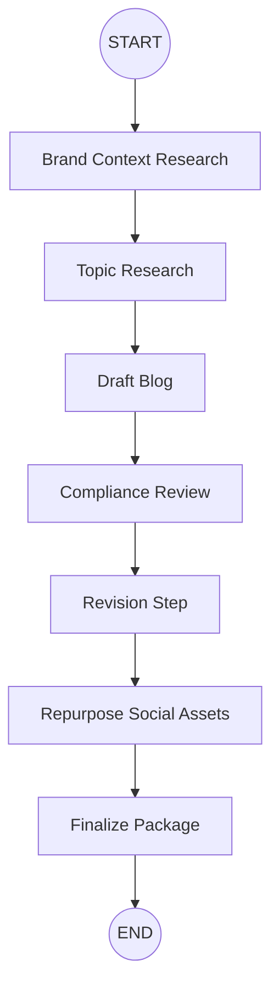
```mermaid
flowchart TD
    Start((START)) --> BrandContext[Brand Context Research]
    BrandContext --> TopicResearch[Topic Research]
    TopicResearch --> DraftBlog[Draft Blog]
    DraftBlog --> Compliance[Compliance Review]
    Compliance --> Revision[Revision Step]
    Revision --> Repurpose[Repurpose Social Assets]
    Repurpose --> Finalize[Finalize Package]
    Finalize --> End((END))
```

### Newsroom Workflow Agent (`backend/news`)

- **State fields:** `prompt`, `tone`, `audience`, `additional_context`, `word_count`, and workflow slots (`research_notes`, `article_draft`, `compliance_report`, `revision_count`).
- **Tools/Models:** Tavily web search to seed `research_notes`, Groq `llama-3.3-70b` for drafting, `llama-3.1-8b` for compliance/revisions. Citations (`[S#]`) are enforced inside prompts.
- **Flow:** Conditional LangGraph with a feedback loop. `should_revise` guards against infinite revisions (`revision_count` max 2).

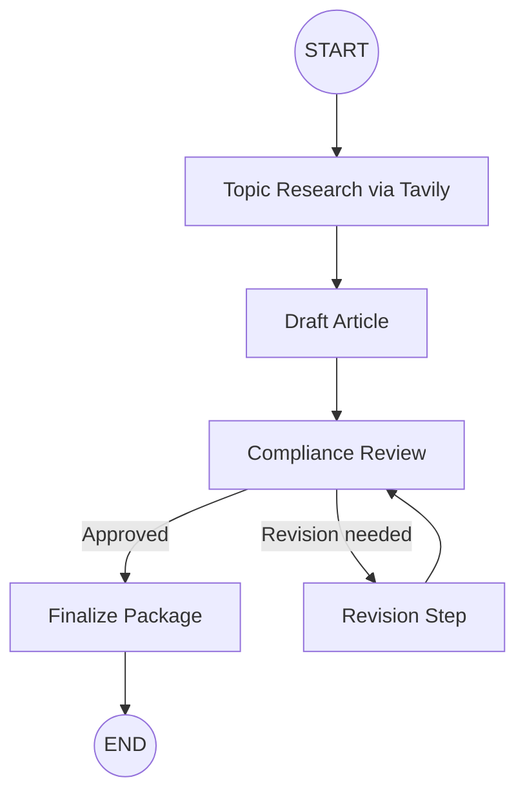
```mermaid
flowchart TD
    Start((START)) --> Research[Topic Research via Tavily]
    Research --> Draft[Draft Article]
    Draft --> Compliance[Compliance Review]
    Compliance -->|Approved| Finalize[Finalize Package]
    Compliance -->|Revision needed| Revise[Revision Step]
    Revise --> Compliance
    Finalize --> End((END))
```

### YouTube Script Agent (`backend/youtube`)

- **State fields:** `channelDescription`, `prompt`, `subscribers`, `videoType`, `tone`, `audience`, `threadId`, with workflow slots (`research_notes`, `script_draft`, `compliance_report`, `revision_count`).
- **Tools/Models:** Groq pair; `determine_duration` inspects the prompt to set pacing for Shorts vs. long-form.
- **Flow:** Linear LangGraph capped by a single revision pass.

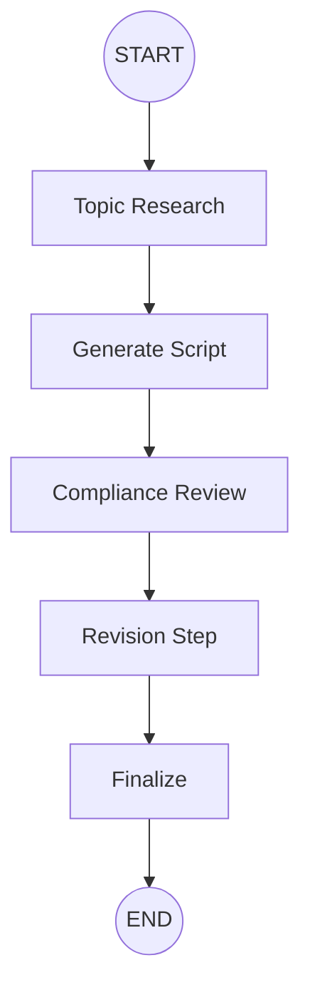
```mermaid
flowchart TD
    Start((START)) --> YTResearch[Topic Research]
    YTResearch --> GenerateScript[Generate Script]
    GenerateScript --> YTCompliance[Compliance Review]
    YTCompliance --> YTRevision[Revision Step]
    YTRevision --> Final[Finalize]
    Final --> End((END))
```

### Content Repurposer Agent (`backend/contentRepurposer`)

- **State fields:** `article_text`, `summary`, `social_posts`, `faq_section`, `entities`, `final_package`.
- **Tools/Models:** Groq `llama-3.1-8b-instant` (text + `response_format={"type":"json_object"}`) to ensure structured outputs.
- **Flow:** Fully parallel LangGraph. Four nodes fan out from `START`, then converge at `compile_package`.

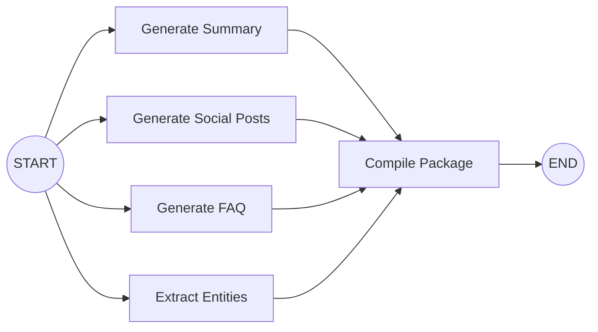
```mermaid
flowchart LR
    Start((START)) --> Summary[Generate Summary]
    Start --> Social[Generate Social Posts]
    Start --> FAQ[Generate FAQ]
    Start --> Entities[Extract Entities]
    Summary --> Compile[Compile Package]
    Social --> Compile
    FAQ --> Compile
    Entities --> Compile
    Compile --> End((END))
```

### Visual Post Generator Agent (`backend/visualPostGenerator`)

- **State fields:** `image_base64`, `context`, `platform`, plus derived `image_caption`, `platform_trends`, `final_post`.
- **Tools/Models:** Modal vision endpoint for captions, Tavily search for trends, Groq `llama-3.1-8b` for final copy.
- **Flow:** Parallel graph where captioning and trend research happen independently before joining.

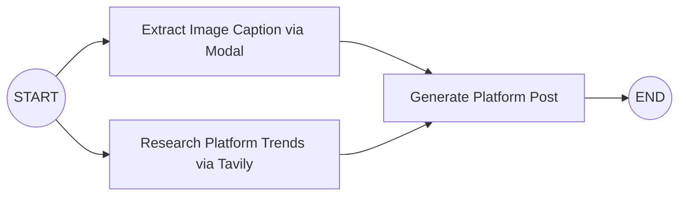
```mermaid
flowchart LR
    Start((START)) --> Caption[Extract Image Caption via Modal]
    Start --> Trends[Research Platform Trends via Tavily]
    Caption --> Writer[Generate Platform Post]
    Trends --> Writer
    Writer --> End((END))
```

### X Post Growth Agent (`backend/x_post`)

- **State (Pydantic):** `topic`, `objective`, `audience`, `tone`, `brand_voice`, `call_to_action`, `product_details`, `keywords`, `word_limit`, `max_iterations`, and optional `human_feedback`.
- **Tools/Models:** Generator + optimizer use `llama-3.3-70b`, evaluator uses `llama-3.1-8b`. No LangGraph—this is a manual multi-iteration loop with audit trails and evaluator thresholds.

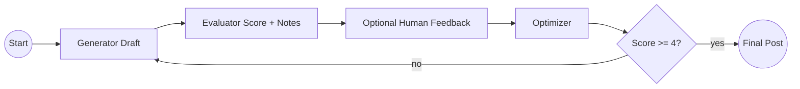
```mermaid
flowchart LR
    Start((Start)) --> Generate[Generator Draft]
    Generate --> Evaluate[Evaluator Score + Notes]
    Evaluate --> Human[Optional Human Feedback]
    Human --> Optimize[Optimizer]
    Optimize --> Decision{Score >= 4?}
    Decision -- yes --> Finalize((Final Post))
    Decision -- no --> Generate
```

### YouTube → Blog Agent (`backend/youtubeBlog`)

- Pulls metadata + transcripts, converts them to markdown, and returns both long-form blog + summary without LangGraph. This agent still follows a deterministic pipeline as illustrated below.

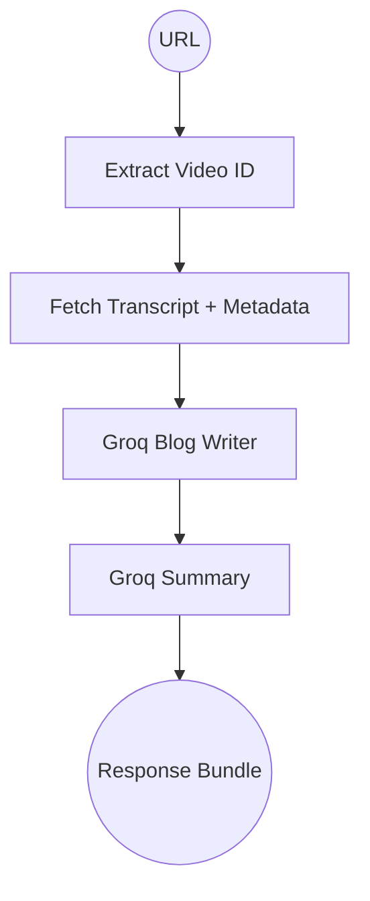
```mermaid
flowchart TD
    Start((URL)) --> ExtractID[Extract Video ID]
    ExtractID --> Transcript[Fetch Transcript + Metadata]
    Transcript --> Blog[Groq Blog Writer]
    Blog --> Summary[Groq Summary]
    Summary --> End((Response Bundle))
```

## LangGraph Implementation Notes

- All graph states inherit from `pydantic.BaseModel`, giving us type-checked memory between nodes.
- Agents such as `BlogWorkflowAgent` and `NewsArticleWorkflowAgent` compile their graphs once on startup (`agent.compile()` inside router modules) to avoid rebuild overhead.
- `thread_id` propagation is explicit (e.g., blog + news routers attach a UUID, so clients can resume sessions).
- Parallel graphs (`ContentRepurposer`, `VisualContentAgent`) use LangGraph’s ability to route arrays (`graph.add_edge([node_a, node_b], join)`), mirroring the Mermaid visuals above.
- Conditional edges (`graph.add_conditional_edges`) on the news workflow prevent infinite loops by checking `revision_count`.

## Local Development

1. **Clone & install dependencies**
   ```bash
   cd backend && python -m venv .venv && source .venv/bin/activate && pip install -r requirements.txt
   cd ../frontend && npm install
   ```
2. **Environment variables** – Duplicate `frontend/.env` and `backend/.env`, replace secrets with your own:

   - `DATABASE_URL` (Neon), `AUTH_SECRET`, `GROQ_API_KEY`, `TAVILY_API_KEY`, `HF_API_TOKEN`.
   - Modal endpoints: `NEXT_PUBLIC_IMAGE_GENERATION`, `MODAL_VISION_ENDPOINT` (update constant or export), `TTS_ENDPOINT`.
   - Supabase bucket credentials live in the Modal workers; only `fileKey/Url` reach this repo.
   - `X_CREDENTIAL_SECRET` for AES-256-GCM.

   In both `frontend/` and `backend/` `.env.example` files exist, please add your own API keys for the respective fields and rename both to `.env`

3. **Prisma + database**
   ```bash
   cd frontend
   npx prisma generate
   npx prisma migrate deploy
   ```
4. **Run services**

   ```bash
   # Terminal 1 – FastAPI
   cd backend && uvicorn main:app --reload --port 8000

   # Terminal 2 – Next.js dashboard
   cd frontend && npm run dev
   ```

5. **Modal workers** – Deploy/update the three Modal apps (vision, SDXL image, TTS). Ensure they write binary payloads to Supabase and expose authenticated HTTPS endpoints referenced by the env vars above.

## Testing

- **Runner + libs:** Jest with `jest-environment-jsdom`, React Testing Library (`@testing-library/react`, `@testing-library/user-event`, `@testing-library/jest-dom`), and `whatwg-fetch` to polyfill `fetch`. `frontend/jest.config.js` wraps Next’s defaults via `next/jest`, applies `@/*` path aliases, and ignores `.next/` + `node_modules/`. `frontend/jest.setup.ts` seeds env vars and extends matchers.
- **Commands:** From `frontend/` run `npm test` for a single pass, or `npm test -- --watch` to iterate. Console output is the primary reporter.
- **What we test (functionality, not model quality):**
  - `frontend/__tests__/blogWorkflow.test.tsx`: submits brand voice + prompt, stubs `/generate-blog` + `/api/save-blog`, asserts article render; image prompt path skipped while image credits are paused.
  - `frontend/__tests__/youtubeBlogPage.test.tsx`: posts URL + brief to `/youtube-blog`, checks payload and rendered metadata/summary/blog.
  - `frontend/__tests__/contentRepurposerPage.test.tsx`: simulates Mammoth script load, posts pasted text to `/repurpose-article`, and verifies summary + social tab content.
  - `frontend/__tests__/xPostWorkflowPage.test.tsx`: fills brief/controls, hits `/x-post/generate`, asserts final post and payload fields (keywords, word/iteration limits, human feedback).
- **Mocking pattern:** Each suite overrides `global.fetch` and inspects payloads to ensure wiring is correct:
  ```ts
  global.fetch = jest.fn((url, options) => {
    if (String(url).includes("/generate-blog")) {
      return Promise.resolve({ ok: true, json: async () => ({ generated_blog: "Result", threadId: "t1" }) });
    }
    return Promise.reject(new Error(`Unexpected fetch: ${url}`));
  }) as unknown as typeof fetch;

  render(<BlogWorkflowPage />);
  await userEvent.type(screen.getByPlaceholderText(/What should/), "Write a launch blog");
  await userEvent.click(screen.getByRole("button", { name: /generate blog assets/i }));
  await screen.findByText("Result");
  ```
- **Explicit gap:** LLM/VLM output quality is not evaluated here; tests validate UI + request plumbing. Image-generation prompts are not executed because hosted model credits are exhausted—they mirror the LLM request pattern and can be enabled once credits refresh.
- Image-generation prompts are not exercised because hosted model credits are exhausted; functionality mirrors other LLM calls and will be picked up once credits refresh.

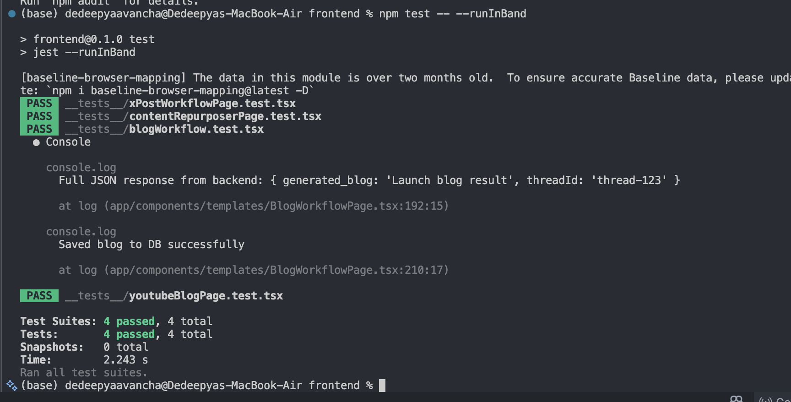

## Operational Notes

- **Agent orchestration:** `backend/api/agent_manager.py` shows how to batch-compile multiple agents if we ever expose a generic `/agent` endpoint.
- **Twitter publishing:** The `/api/x/post` route is the only place that leaves our infrastructure. Everything else (research, drafting, storage, media rendering) is handled internally through LangGraph, Groq, Tavily, Modal, Neon, and Supabase.
- **Security:** User JWTs live in HTTP-only cookies. X credentials are encrypted at rest via AES-256-GCM with a dedicated `X_CREDENTIAL_SECRET`. Binary media is never stored on-disk—only Supabase public URLs plus `fileKey` references are persisted in Neon.
- **Extensibility:** Each agent already exposes a typed state + LangGraph definition. Adding a new modality means appending a node to the relevant `StateGraph` and updating the Mermaid diagrams above to keep documentation in sync.
